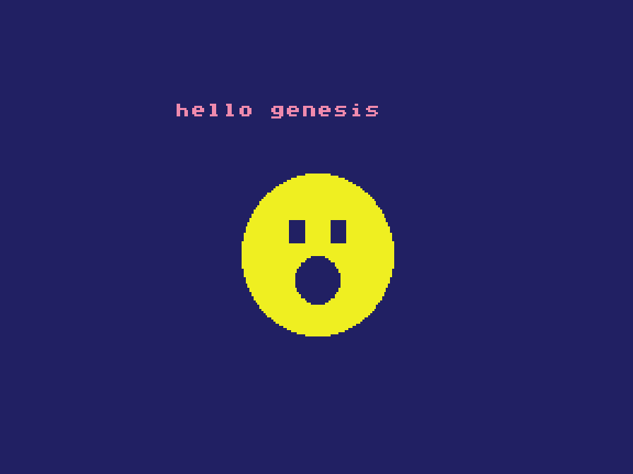
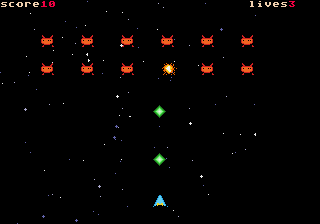

# Mega Drive Lua SDK (mdlua)

Make games for the **Sega Mega Drive / Genesis** by writing a
**PICO-8-flavored Lua** instead of C or 68000 assembly.

The SDK compiles your Lua to C, builds it with a bundled m68k toolchain
against an SGDK runtime, and produces a `.bin` ROM that runs in any Genesis
emulator and on real hardware via flashcart. No interpreter, no VM: your Lua
becomes native 68000 machine code.

If you know PICO-8 you'll feel at home (`spr`/`btn`/`_init`/`_update`/`_draw`,
Lua syntax) - but this SDK leans into what the Genesis can do that a fantasy
console can't: **80 hardware sprites, two free-scrolling tile planes plus a
window-plane HUD, LIVE `pal()` (real palette RAM), per-scanline raster
scroll, shadow/highlight, whole-screen palette fades, YM2612 FM music + PCM
sound effects, battery saves, and a real second controller.** Familiarity,
not compatibility.

mdlua is the third SDK in a family that shares one compiler front-end and
number model: [gtlua](https://github.com/monteslu/gametank_lua_sdk) targets
the GameTank (6502), gbalua the Game Boy Advance (ARM), and mdlua the
Genesis (68000).

## Your first game

A complete Genesis game - one `main.lua`, no assets:

```lua
-- Colors are PICO-8-style indices 0-15 (0 black, 1 dark-blue, 10 yellow, 14 pink).
function _draw()
  cls(1)                                -- dark blue background

  print("hello genesis", 88, 16, 14)    -- title text, pink, near the top

  circfill(128, 88, 38, 10)             -- head: a big yellow circle
  rectfill(114, 72, 121, 82, 0)         -- left eye: a black square
  rectfill(135, 72, 142, 82, 0)         -- right eye
  circfill(128, 100, 11, 0)             -- mouth: a black circle
end
```

<p align="center">
  
</p>

Build it to a ROM and run it:

```sh
mdlua build main.lua -o hello.bin
mdlua run hello.bin
```

`mdlua run` opens an emulator window (bundled Genesis Plus GX core): arrows =
d-pad, `Z`/`X`/`C` = the A/B/C buttons, Enter = START. The same `.bin` runs
in any Genesis emulator or on a flashcart. That's the whole loop: write
`main.lua`, build the `.bin`, ship it.

For the real thing, build the flagship example - a complete shmup with a
scrolling starfield, sprites, score/lives HUD, and FM music:

```sh
mdlua build examples/starfall/main.lua \
  --sheet examples/starfall/shmup_sheet.png \
  --map examples/starfall/space_bg.png -o starfall.bin
mdlua run starfall.bin
```

## Requirements

- [Node.js](https://nodejs.org/) **24+**
- **nothing else** - `npm install` brings the whole toolchain as published
  packages: m68k-gcc + SGDK + the XGM2 sound driver, all **as WebAssembly**
  (via [`romdev-toolchain-m68k-gcc`](https://www.npmjs.com/package/romdev-toolchain-m68k-gcc),
  pinned). No SGDK install, no cross-compiler to build, no native tools.

The build runs the WASM toolchain in-process (`cc1-m68k` → `as` → `ld` →
`objcopy`), pads the ROM, and writes the header checksum strict loaders
demand. `mdlua run` uses the bundled
[`romdev-core-gpgx`](https://www.npmjs.com/package/romdev-core-gpgx) emulator
core (the window needs the optional `@kmamal/sdl`; without it, run the `.bin`
in any Genesis emulator).

## The screen and the two draw paths

The screen is **320×224**. Two ways to draw; sprites and sound compose over
both.

- **Sprites + tile planes** - the real game path. `spr()` is a hardware
  sprite (80 per frame), `map_show()` puts your tilemap on a hardware plane,
  and `camera()` scrolls it for free. This is what the flagship example
  (`starfall`) uses.
- **Bitmap verbs** - immediate `pset`/`rect`/`circ`/`line` into a 256×160
  software framebuffer (the SGDK BMP engine, lazy-initialized, ~41 KB of the
  64 KB work RAM). Simplest to start with (the hello above); not the
  scrolling-game path.

## The PICO-8 contract

Define `_update60()` plus `_draw()`, and optionally `_init()`. The runtime
latches input before each update and ends the frame after `_draw()` (sprite
list + palette flush as queued DMA at vblank).

**Numbers are PICO-8 numbers**: 16.16 fixed point. `sin`/`cos`/`atan2` use
turns (0..1) with PICO-8's screen-space-inverted sin. The compiler keeps
values that stay integral in fast 32-bit ints - an optimization, never a
semantic change.

**The dialect** keeps PICO-8's syntax: `+=`-style compound assignment,
one-line `if (cond) stmt` / `while (cond) stmt`, `!=`, `\` floor division,
`//` comments, hex/binary literals with fractions, and multiple assignment
(`x, y = 64, 32`).

**Arrays are 1-indexed** (Lua/PICO-8 style): `a = array(8)`, then `a[1]` is
the first element.

## API at a glance

| | |
|---|---|
| lifecycle | `_init` `_update60` (`_update`) `_draw` |
| bitmap draw | `cls` `color` `pset` `pget` `clip` `rect` `rectfill` `circ` `circfill` `line` |
| text | `print(v,x,y,[c])` · `print(v,[c])` cursor form - tile grid, white + 1 cached color |
| sprites | `spr(n,x,y,[w,h],[fx,fy])` hardware sprite · `spr8(t,x,y,[flip])` · `spr_pal` `spr_prio` |
| tile plane | `map_show` · `camera(x,y)` hardware scroll · `tget`/`tset` · `layer_scroll` · `map`/`mget` (in-source `hexdata` maps) |
| palette | `pal(c0,c1)` **live CRAM remap** · `pal()` reset · `fade(amount,[white])` · `backdrop` · `screen_off`/`screen_on` |
| raster | `hscroll(line,x)` per-scanline plane scroll - the Genesis signature |
| HUD | `hud(rows)` window-plane status strip · `shade_mode(on)` shadow/highlight |
| animation | `anim(slot,first,last,fps)` loop · `anim_once` · `anim_pingpong` · `anim_reset` · `anim_done` |
| input | `btn(i,[pl])` `btnp(i,[pl])` - 0-3 d-pad, 4=B, 5=C, 6=A, 7=START, 8-11=X/Y/Z/MODE; `pl` 0/1 = two real pads |
| math | `flr` `ceil` `abs` `sgn` `sqrt` `min` `max` `mid` `sin` `cos` `atan2` `rnd` `srand` `t`/`time` + bit ops |
| data | `array(n,[v])` 16.16 · `array8(n,[v])` bytes · `pool(n)` + `add`/`del`/`all` · `hexdata("...")` |
| save | `save(slot,array8,n)` · `load(slot,array8,n)` - battery SRAM, 256-byte slots |
| time | `t()`/`time()` · `realframes()` · `realsecs()` · `run()`/`reset()` |
| sound | `music(n,[loop])` XGM2 FM · `sfx(n,[ch])` PCM bank (`--sfx`), PSG fallback |

See **[docs/CHEATSHEET.md](docs/CHEATSHEET.md)** for every verb with
signatures and the honest limits.

## The Genesis flavor

The reason this target is fun:

- **`pal()` is real.** CRAM is writable at runtime, so palette cycling,
  hit-flashes, and day/night are one call - the thing PICO-8 carts always
  faked. All palette traffic rides a shadow flushed as one DMA per frame
  (mid-frame CRAM writes race the VDP; the runtime already learned that
  lesson so you don't have to).
- **`hscroll(line, x)`** sets the map plane's horizontal scroll per scanline
  - wavy water, heat shimmer, split-screen parallax. 224 lines, one DMA.
- **FM music.** `music(n)` plays song n from your `--music` bank through the
  XGM2 driver on the Z80 - the sound of the platform. `music(-1)` stops,
  `music(n, false)` plays once. `sfx(n)` fires PCM samples from your `--sfx`
  bank OVER the music (PSG blip fallback so you hear something before assets
  exist; a built-in demo tune answers `music()` before you add songs).
- **`hud(rows)`** claims the VDP's third plane as an unscrollable status bar;
  `print` routes into it automatically.
- **Two players are real**: `btn(i, 1)` reads the second pad.

## Assets

`--sheet sprites.png` imports a sprite sheet (8×8 cells, row-major, up to 15
opaque colors + transparent), `--map level.png` a tilemap (deduped tiles),
via a self-contained PNG → VDP-tile converter (`compiler/png-tiles.mjs`).
`--sfx a.wav,b.wav` builds the PCM sample bank (converted to the XGM2
contract: 8-bit signed 13.3 kHz, 256-byte aligned).
`--music intro.vgm,level.vgm` builds the song bank - bank order is the
`music(n)` index. `.vgm` comes from any Mega Drive tracker (DefleMask,
Furnace: export VGM); gzipped `.vgz` and precompiled `.xgc` work too. The
VGM → XGM2 conversion is byte-identical to SGDK's own xgm2tool.

```sh
mdlua build mygame/main.lua \
  --sheet mygame/sprites.png --map mygame/level.png \
  --sfx mygame/laser.wav --music mygame/theme.vgm -o mygame/game.bin
```

`mdlua c main.lua` prints the generated C for debugging.

The `examples/` directory shows each subsystem in use:

| example | shows |
|---|---|
| `hello` | shapes + text, no assets - the smallest cart |
| `mvp` | a sheet, animated + flipped sprites, text colors, input |
| `anim` | the frame-range animation helpers (loop / ping-pong / once) |
| `raster` | the Genesis showcase: `hscroll` waves + live `pal()` cycling + window HUD + FM |
| `platformer` | tiles + sprites + gravity/jump - the genre starter |
| `starfall` | a complete shmup - scrolling tile plane, sprites, HUD, music |
| `music` | the `--music` song bank: switch / stop / play-once / sfx over music |
| `pcm` | raw PCM through SGDK's standalone `SND_PCM` driver |
| `sgdk_direct` | raw SGDK calls (`VDP_*`, `PAL_*`) mixed with PICO-8 verbs |
| `coroutine` | an SGDK user task (`TSK_userSet`) running a Lua function |
| `vint_callback` | a Lua function as the vblank interrupt hook |
| `sprite_callback` | the SGDK sprite engine calling back into Lua |

<p align="center">
  
</p>

## Not-Lua walls (loud, never silent)

Conditions must be boolean (`if x ~= 0 then`, not `if x then` - Lua calls 0
truthy, C doesn't, and the compiler refuses to guess). No `nil`, closures,
metatables, Lua coroutines, string concatenation, or `goto` (SGDK's 68k
task API - `TSK_userSet` and friends - covers the background-work use case
natively; see `examples/coroutine`). Every unsupported feature is a
compile-time error that says what to write instead.

## Repo layout

`compiler/` the Lua→C compiler + the Genesis build driver (`build-md.mjs`)
and PNG importer (`png-tiles.mjs`) · `md-sdk/` the C runtime (thin SGDK
wrappers: `md_api.c` frame + sprites + planes + palette + text + sound,
`md_anim.c`, `md_math.c` the 16.16 math) · `bin/mdlua.js` CLI +
`bin/mdlua-run.mjs` the emulator window · `examples/` · `test/`.

## Docs

| doc | what |
|---|---|
| [docs/CHEATSHEET.md](docs/CHEATSHEET.md) | the full mdlua API reference |
| [docs/CHEATSHEET_FOR_PICO8_USERS.md](docs/CHEATSHEET_FOR_PICO8_USERS.md) | per-function PICO-8 → Genesis map |

## License

MIT. The runtime wraps [SGDK](https://github.com/Stephane-D/SGDK) (MIT),
built by the published `romdev-toolchain-m68k-gcc` package; the compiler
front-end is shared with the [GameTank Lua SDK](https://github.com/monteslu/gametank_lua_sdk)
(MIT). PICO-8 is by Lexaloffle Games; the Sega Mega Drive / Genesis is Sega
hardware. This SDK is an independent homebrew toolchain.
